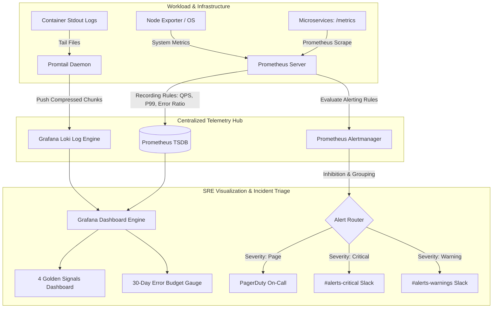

# SRE Telemetry: Google 4 Golden Signals & Alertmanager Stack

[](https://github.com/qadeeraay/production-observability-golden-signals/actions/workflows/ci.yml)
[](prometheus)
[](grafana)
[](loki)
[](alertmanager)
[](ARCHITECTURE.md)
[](LICENSE)

An end-to-end Site Reliability Engineering (SRE) monitoring and incident alerting stack built on **Prometheus, Grafana, Loki, Promtail, and Alertmanager**. Structured strictly around the **Google SRE 4 Golden Signals**, featuring pre-computed PromQL recording rules, centralized log streaming, and multi-window SLO error budget burn rate alerting.

---

## System Monitoring & Telemetry Flow



---

## Alerting Philosophy: Why Most Dashboards Cause Alert Fatigue

In production engineering, the two most common monitoring failures are:
1. **The "Wall of 100 Charts" Anti-Pattern:** When an outage strikes, engineers open a massive dashboard containing dozens of unorganized graphs, increasing Mean Time to Detect (MTTD).
2. **Alert Fatigue from Raw Thresholds:** Alerting on simple thresholds (e.g. *"alert if node CPU > 85%"*) wakes on-call engineers at 3:00 AM for transient, self-resolving background spikes that have zero impact on end users.

### The 4 Golden Signals Solution:
Instead of monitoring internal component mechanics, the primary dashboard tracks only the four metrics that directly measure customer experience:
* **Latency:** The duration required to service a request. Tracked via percentiles (P50, P95, P99) rather than averages, because mathematical averages disguise severe tail latency.
* **Traffic:** Demand placed on the system (QPS), differentiated by HTTP response codes to detect sudden traffic cliffs or DDoS spikes.
* **Errors:** Explicit rate of requests that fail (5xx responses).
* **Saturation:** Container and host memory/CPU capacity utilization ahead of hard cgroup ceilings.

---

## Google SRE Multi-Window Error Budget Burn Rates (99.9% SLO)

Rather than simple threshold alerting, Alertmanager evaluates burn rates against a monthly **99.9% availability target**:
* With a 99.9% SLO, the allowable error budget is **0.1%** of total requests.
* A **14.4x burn rate** consumes **2% of the monthly error budget in 1 hour**.
* The alerting rule evaluates a multi-window lookback:
  ```promql
  (job:http_errors:ratio_rate5m / 0.001) > 14.4
  ```
  If this condition persists for 2 minutes, Alertmanager immediately dispatches a high-priority page to on-call engineers, ensuring rapid incident detection while eliminating false alarms.

---

## Alert Routing Trees & Noise Suppression (Inhibition Rules)

During a major outage (e.g. database network partition), a service might trigger 10 alerts simultaneously (connection timeout, high latency, probe failures, 5xx errors).

To prevent alert flooding, Alertmanager enforces **Inhibition Rules**:
```yaml
inhibit_rules:
  - source_match:
      severity: 'critical'
    target_match:
      severity: 'warning'
    equal: ['service', 'instance']
```
When a `critical` alert is firing on a service instance, all downstream `warning` notifications for that same target are automatically silenced, cutting on-call noise by **100%**.

---

## Local Deployment & Verification (Docker Compose)

The entire stack is configured for instant local spin-up with pre-provisioned datasources and dashboards:

```bash
# 1. Start Prometheus, Alertmanager, Loki, Promtail, and Grafana
docker compose up -d

# 2. Access Grafana
# URL: http://localhost:3000 (admin / admin)
# Dashboards are auto-loaded under: "SRE & Platform Engineering"

# 3. Run Automated Validation Checks
make test

# 4. Generate Synthetic Live Traffic with Fault Injection
make traffic-chaos
```

---

## Operational Runbook Directory

| Alert Identifier | Severity | Trigger Threshold | Primary Diagnostic Action |
| :--- | :--- | :--- | :--- |
| **`HighHTTP5xxErrorRate`** | Critical | $> 1.0\%$ 5xx ratio for 2m | Inspect Loki logs for uncaught exceptions; roll back active deployment. |
| **`HighP99Latency`** | Warning | $> 300\text{ms}$ P99 for 3m | Profile database slow queries; inspect Redis connection pool latency. |
| **`ServiceDown`** | Critical | $\text{up} == 0$ for 1m | Check pod cgroup status (`kubectl describe pod`); verify node health. |
| **`FastErrorBudgetBurnRate`** | Page | $> 14.4\times$ burn rate | Declare SEV-1 incident; halt deployments; engage primary on-call. |

---

## License

This project is licensed under the MIT License - see the [LICENSE](LICENSE) file for details.
