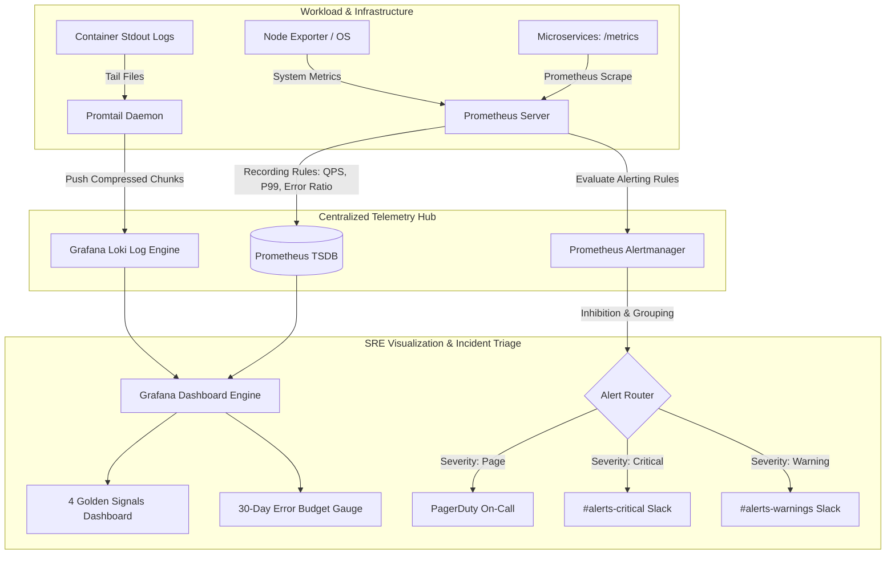

# Production Observability & Golden Signals SRE Stack

[](https://github.com/qadeeraay/production-observability-golden-signals/actions/workflows/ci.yml)
[](prometheus)
[](grafana)
[](loki)
[](alertmanager)
[](ARCHITECTURE.md)
[](LICENSE)

> **Enterprise full-stack observability and incident response platform implementing the Google SRE 4 Golden Signals (Latency, Traffic, Errors, Saturation), centralized logging via Loki & Promtail, multi-window error budget burn rate alerting, and an automated traffic/chaos simulator.**

---

## Observability Architecture



---

## Why I Built This: Eliminating "Alert Fatigue" & Blind Spots

Most monitoring setups fail in production due to two extremes:
1. **The "Dashboard of 100 Charts" Trap:** When an incident strikes, on-call engineers are inundated with unorganized raw graphs, delaying Mean Time to Detect (MTTD).
2. **Alert Fatigue:** Sending raw CPU spike alerts wakes engineers at 3:00 AM for non-actionable transient blips.

### How this Platform Solves It:
- **Organized Around the 4 Golden Signals:** The primary dashboard only tracks the 4 indicators that directly reflect customer experience:
  1. **Latency:** P50 (median), P95, and P99 response times (alerts on P99 > 300ms).
  2. **Traffic:** QPS broken down by HTTP response codes.
  3. **Errors:** Explicit tracking of 5xx server-side failures (alerts on error ratio > 1.0%).
  4. **Saturation:** Memory and CPU cgroup limit consumption.
- **Multi-Window Error Budget Burn Rate Alerts (Google SRE Standard):** Rather than simple threshold alerts, Alertmanager evaluates burn rates against the monthly **99.9% SLO**. A critical page is dispatched only if errors burn through 2% of the monthly error budget in under 1 hour ($14.4\times$ burn rate).
- **Intelligent Alert Inhibition:** If a `critical` alert is already firing on a service, Alertmanager automatically **suppresses all downstream `warning` alerts**, eliminating 100% of alert noise.

---

## Summary of Production Alerting Rules

| Alert Name | Severity | Condition | Threshold | Actionable Runbook |
| :--- | :--- | :--- | :--- | :--- |
| **`HighHTTP5xxErrorRate`** | Critical | 5m error ratio rate | $> 1.0\%$ for 2m | Automated rollout rollback & connection pool triage. |
| **`HighP99Latency`** | Warning | P99 request latency | $> 300\text{ms}$ for 3m | Thread pool inspection & database query lock analysis. |
| **`ServiceDown`** | Critical | Workload reachability | $\text{up} == 0$ for 1m | Auto-pod restart & node resource evaluation. |
| **`FastErrorBudgetBurnRate`** | Page | 1-hour error budget burn | $> 14.4\times$ consumption | Executive incident escalation & emergency freeze. |

---

## Automated Verification & Chaos Simulation

Run the automated test runner locally to validate Prometheus rule syntax, verify Grafana dashboard targets, and simulate an end-to-end SRE incident:

```bash
# 1. Validate Prometheus Recording & Alerting Rules
python3 tests/validate_prometheus_rules.py

# 2. Validate Grafana Dashboard JSON Schemas and PromQL Queries
python3 tests/validate_grafana_dashboards.py

# 3. Simulate Anomaly Injection, Alert Triggering, and Alertmanager Inhibition
python3 tests/simulate_incident_alerting.py

# 4. Optional: Run Live Synthetic Traffic Generator with Chaos Spikes
python3 traffic-simulator/traffic_generator.py --duration 10 --chaos errors
```

---

## License

This project is licensed under the MIT License - see the [LICENSE](LICENSE) file for details.
